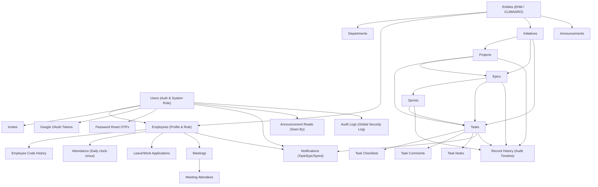

# EHM-CLIMAGRO OS — COMPREHENSIVE ARCHITECTURE & SYSTEM AUDIT (PHASE 0)
**Generated**: 2026-10-05  
**Auditor**: Senior Software Architect / Senior QA / Database Auditor  
**Status**: COMPLETE (Phase 0 Map The System)

---

## 1. TABLE INVENTORY & SCHEMA SPECIFICATION (ALL 27 TABLES)

The database consists of **27 tables** defined in `lib/db/src/schema/*.ts`. Below is the complete catalog of all tables, columns, primary keys, foreign keys, unique constraints, and indexes.

### Table: `announcements` (Defined in `announcements.ts`)
| Column | Data Type | Nullable | Primary Key | Default | Foreign Key | Unique |
| :--- | :--- | :--- | :--- | :--- | :--- | :--- |
| `id` | `uuid` | YES | YES | YES | - | NO |
| `title` | `varchar` | NO | NO | NO | - | NO |
| `content` | `text` | NO | NO | NO | - | NO |
| `priority` | `announcementPriorityEnum` | NO | NO | YES | - | NO |
| `is_pinned` | `boolean` | NO | NO | YES | - | NO |
| `target_entity_id` | `uuid` | YES | NO | NO | `entities.id` | NO |
| `created_by` | `uuid` | YES | NO | NO | `users.id` | NO |
| `seen_by` | `jsonb` | NO | NO | YES | - | NO |
| `created_at` | `timestamp` | NO | NO | NO | - | NO |

---

### Table: `applications` (Defined in `applications.ts`)
| Column | Data Type | Nullable | Primary Key | Default | Foreign Key | Unique |
| :--- | :--- | :--- | :--- | :--- | :--- | :--- |
| `id` | `uuid` | YES | YES | YES | - | NO |
| `employee_id` | `uuid` | NO | NO | NO | `employees.id` | NO |
| `type` | `applicationTypeEnum` | NO | NO | NO | - | NO |
| `reason` | `text` | NO | NO | NO | - | NO |
| `status` | `applicationStatusEnum` | NO | NO | YES | - | NO |
| `reviewed_by` | `uuid` | YES | NO | NO | `employees.id` | NO |
| `created_at` | `timestamp` | NO | NO | NO | - | NO |
| `updated_at` | `timestamp` | NO | NO | NO | - | NO |

---

### Table: `attendance` (Defined in `attendance.ts`)
| Column | Data Type | Nullable | Primary Key | Default | Foreign Key | Unique |
| :--- | :--- | :--- | :--- | :--- | :--- | :--- |
| `id` | `uuid` | YES | YES | YES | - | NO |
| `employee_id` | `uuid` | NO | NO | NO | `employees.id` | NO |
| `date` | `date` | NO | NO | NO | - | NO |
| `clock_in` | `timestamp` | NO | NO | NO | - | NO |
| `clock_out` | `timestamp` | YES | NO | NO | - | NO |
| `work_mode` | `workModeEnum` | NO | NO | YES | - | NO |
| `status` | `attendanceStatusEnum` | NO | NO | YES | - | NO |
| `total_hours` | `decimal` | YES | NO | YES | - | NO |
| `created_at` | `timestamp` | NO | NO | NO | - | NO |

---

### Table: `audit_logs` (Defined in `audit_logs.ts`)
| Column | Data Type | Nullable | Primary Key | Default | Foreign Key | Unique |
| :--- | :--- | :--- | :--- | :--- | :--- | :--- |
| `id` | `uuid` | YES | YES | YES | - | NO |
| `user_id` | `uuid` | YES | NO | NO | - | NO |
| `action` | `varchar` | NO | NO | NO | - | NO |
| `details` | `jsonb` | NO | NO | YES | - | NO |
| `created_at` | `timestamp` | NO | NO | NO | - | NO |

---

### Table: `departments` (Defined in `departments.ts`)
| Column | Data Type | Nullable | Primary Key | Default | Foreign Key | Unique |
| :--- | :--- | :--- | :--- | :--- | :--- | :--- |
| `id` | `uuid` | YES | YES | YES | - | NO |
| `entity_id` | `uuid` | NO | NO | NO | `entities.id` | NO |
| `name` | `varchar` | NO | NO | NO | - | NO |
| `code` | `varchar` | NO | NO | NO | - | NO |
| `created_at` | `timestamp` | NO | NO | NO | - | NO |

---

### Table: `employees` (Defined in `employees.ts`)
| Column | Data Type | Nullable | Primary Key | Default | Foreign Key | Unique |
| :--- | :--- | :--- | :--- | :--- | :--- | :--- |
| `id` | `uuid` | YES | YES | YES | - | NO |
| `employee_code` | `varchar` | NO | NO | NO | - | YES |
| `task_seq_counter` | `integer` | NO | NO | YES | - | NO |
| `first_name` | `varchar` | NO | NO | NO | - | NO |
| `last_name` | `varchar` | NO | NO | NO | - | NO |
| `email` | `varchar` | NO | NO | NO | - | YES |
| `phone` | `varchar` | YES | NO | NO | - | NO |
| `entity_id` | `uuid` | NO | NO | NO | `entities.id` | NO |
| `department_id` | `uuid` | NO | NO | NO | `departments.id` | NO |
| `designation` | `varchar` | NO | NO | NO | - | NO |
| `salary` | `decimal` | YES | NO | NO | - | NO |
| `joining_date` | `timestamp` | NO | NO | NO | - | NO |
| `status` | `employeeStatusEnum` | NO | NO | YES | - | NO |
| `avatar_url` | `varchar` | YES | NO | NO | - | NO |
| `created_at` | `timestamp` | NO | NO | NO | - | NO |
| `updated_at` | `timestamp` | NO | NO | NO | - | NO |

---

### Table: `employee_code_history` (Defined in `employee_code_history.ts`)
| Column | Data Type | Nullable | Primary Key | Default | Foreign Key | Unique |
| :--- | :--- | :--- | :--- | :--- | :--- | :--- |
| `id` | `uuid` | YES | YES | YES | - | NO |
| `employee_id` | `uuid` | YES | NO | NO | - | NO |
| `old_code` | `varchar` | NO | NO | NO | - | NO |
| `new_code` | `varchar` | NO | NO | NO | - | NO |
| `old_role` | `varchar` | YES | NO | NO | - | NO |
| `new_role` | `varchar` | YES | NO | NO | - | NO |
| `changed_by` | `text` | YES | NO | NO | - | NO |
| `changed_at` | `timestamp` | NO | NO | NO | - | NO |

---

### Table: `entities` (Defined in `entities.ts`)
| Column | Data Type | Nullable | Primary Key | Default | Foreign Key | Unique |
| :--- | :--- | :--- | :--- | :--- | :--- | :--- |
| `id` | `uuid` | YES | YES | YES | - | NO |
| `code` | `varchar` | NO | NO | NO | - | YES |
| `name` | `varchar` | NO | NO | NO | - | NO |
| `created_at` | `timestamp` | NO | NO | NO | - | NO |

---

### Table: `entity_counters` (Defined in `entity_counters.ts`)
| Column | Data Type | Nullable | Primary Key | Default | Foreign Key | Unique |
| :--- | :--- | :--- | :--- | :--- | :--- | :--- |
| `entity_id` | `uuid` | YES | YES | NO | `entities.id` | NO |
| `next_employee_seq` | `integer` | NO | NO | YES | - | NO |
| `next_initiative_seq` | `integer` | NO | NO | YES | - | NO |
| `next_epic_seq` | `integer` | NO | NO | YES | - | NO |
| `next_sprint_seq` | `integer` | NO | NO | YES | - | NO |
| `next_backlog_task_seq` | `integer` | NO | NO | YES | - | NO |

---

### Table: `epics` (Defined in `epics.ts`)
| Column | Data Type | Nullable | Primary Key | Default | Foreign Key | Unique |
| :--- | :--- | :--- | :--- | :--- | :--- | :--- |
| `id` | `uuid` | YES | YES | YES | - | NO |
| `epic_code` | `varchar` | NO | NO | NO | - | YES |
| `title` | `varchar` | NO | NO | NO | - | NO |
| `description` | `text` | YES | NO | NO | - | NO |
| `initiative_id` | `uuid` | YES | NO | NO | `initiatives.id` | NO |
| `project_id` | `uuid` | YES | NO | NO | `projects.id` | NO |
| `entity_id` | `uuid` | NO | NO | NO | `entities.id` | NO |
| `department` | `varchar` | YES | NO | NO | - | NO |
| `target_week` | `varchar` | YES | NO | NO | - | NO |
| `sprints_count_target` | `integer` | YES | NO | YES | - | NO |
| `next_task_seq` | `integer` | NO | NO | YES | - | NO |
| `status` | `epicStatusEnum` | NO | NO | YES | - | NO |
| `owner_id` | `uuid` | YES | NO | NO | `employees.id` | NO |
| `assigned_to` | `text` | YES | NO | NO | - | NO |
| `created_by_id` | `uuid` | YES | NO | NO | `employees.id` | NO |
| `created_by_name` | `text` | YES | NO | NO | - | NO |
| `target_date` | `timestamp` | YES | NO | NO | - | NO |
| `created_at` | `timestamp` | NO | NO | NO | - | NO |

---

### Table: `global_counters` (Defined in `global_counters.ts`)
| Column | Data Type | Nullable | Primary Key | Default | Foreign Key | Unique |
| :--- | :--- | :--- | :--- | :--- | :--- | :--- |
| `id` | `integer` | YES | YES | YES | - | NO |
| `next_admn_seq` | `integer` | NO | NO | YES | - | NO |
| `next_mana_seq` | `integer` | NO | NO | YES | - | NO |
| `next_team_seq` | `integer` | NO | NO | YES | - | NO |
| `next_init_seq` | `integer` | NO | NO | YES | - | NO |
| `next_epic_seq` | `integer` | NO | NO | YES | - | NO |
| `next_epic_task_seq` | `integer` | NO | NO | YES | - | NO |
| `next_sprint_task_seq` | `integer` | NO | NO | YES | - | NO |
| `next_blog_task_seq` | `integer` | NO | NO | YES | - | NO |
| `next_sprint_seq` | `integer` | NO | NO | YES | - | NO |
| `next_project_seq` | `integer` | NO | NO | YES | - | NO |

---

### Table: `google_tokens` (Defined in `google_tokens.ts`)
| Column | Data Type | Nullable | Primary Key | Default | Foreign Key | Unique |
| :--- | :--- | :--- | :--- | :--- | :--- | :--- |
| `id` | `uuid` | YES | YES | YES | - | NO |
| `user_id` | `uuid` | NO | NO | NO | `users.id` | YES |
| `access_token` | `varchar` | NO | NO | NO | - | NO |
| `refresh_token` | `varchar` | NO | NO | NO | - | NO |
| `expiry` | `timestamp` | NO | NO | NO | - | NO |
| `created_at` | `timestamp` | NO | NO | NO | - | NO |
| `updated_at` | `timestamp` | NO | NO | NO | - | NO |

---

### Table: `initiatives` (Defined in `initiatives.ts`)
| Column | Data Type | Nullable | Primary Key | Default | Foreign Key | Unique |
| :--- | :--- | :--- | :--- | :--- | :--- | :--- |
| `id` | `uuid` | YES | YES | YES | - | NO |
| `initiative_code` | `varchar` | NO | NO | NO | - | YES |
| `entity_id` | `uuid` | NO | NO | NO | `entities.id` | NO |
| `department_id` | `uuid` | YES | NO | NO | `departments.id` | NO |
| `sub_department` | `varchar` | YES | NO | NO | - | NO |
| `title` | `varchar` | NO | NO | NO | - | NO |
| `description` | `text` | YES | NO | NO | - | NO |
| `target_month` | `varchar` | YES | NO | NO | - | NO |
| `epics_count_target` | `integer` | YES | NO | YES | - | NO |
| `target_deliverable_metric` | `text` | YES | NO | NO | - | NO |
| `status` | `initiativeStatusEnum` | NO | NO | YES | - | NO |
| `owner_id` | `uuid` | YES | NO | NO | `employees.id` | NO |
| `created_by_id` | `uuid` | YES | NO | NO | `employees.id` | NO |
| `created_by_name` | `text` | YES | NO | NO | - | NO |
| `target_date` | `timestamp` | YES | NO | NO | - | NO |
| `created_at` | `timestamp` | NO | NO | NO | - | NO |

---

### Table: `invites` (Defined in `invites.ts`)
| Column | Data Type | Nullable | Primary Key | Default | Foreign Key | Unique |
| :--- | :--- | :--- | :--- | :--- | :--- | :--- |
| `id` | `uuid` | YES | YES | YES | - | NO |
| `email` | `varchar` | NO | NO | NO | - | NO |
| `token` | `varchar` | NO | NO | NO | - | YES |
| `role` | `userRoleEnum` | NO | NO | YES | - | NO |
| `employee_id` | `uuid` | NO | NO | NO | `employees.id` | NO |
| `status` | `inviteStatusEnum` | NO | NO | YES | - | NO |
| `expires_at` | `timestamp` | NO | NO | NO | - | NO |
| `created_at` | `timestamp` | NO | NO | NO | - | NO |

---

### Table: `meetings` (Defined in `meetings.ts`)
| Column | Data Type | Nullable | Primary Key | Default | Foreign Key | Unique |
| :--- | :--- | :--- | :--- | :--- | :--- | :--- |
| `id` | `uuid` | YES | YES | YES | - | NO |
| `title` | `varchar` | NO | NO | NO | - | NO |
| `description` | `text` | YES | NO | NO | - | NO |
| `start_time` | `timestamp` | NO | NO | NO | - | NO |
| `end_time` | `timestamp` | NO | NO | NO | - | NO |
| `location` | `varchar` | NO | NO | YES | - | NO |
| `google_meet_url` | `varchar` | YES | NO | NO | - | NO |
| `organizer_id` | `uuid` | NO | NO | NO | `employees.id` | NO |
| `invitees` | `jsonb` | NO | NO | YES | - | NO |
| `google_event_id` | `varchar` | YES | NO | NO | - | YES |
| `source` | `meetingSourceEnum` | NO | NO | YES | - | NO |
| `status` | `meetingStatusEnum` | NO | NO | YES | - | NO |
| `created_at` | `timestamp` | NO | NO | NO | - | NO |

---

### Table: `meeting_attendees` (Defined in `meeting_attendees.ts`)
| Column | Data Type | Nullable | Primary Key | Default | Foreign Key | Unique |
| :--- | :--- | :--- | :--- | :--- | :--- | :--- |
| `id` | `uuid` | YES | YES | YES | - | NO |
| `meeting_id` | `uuid` | NO | NO | NO | `meetings.id` | NO |
| `employee_id` | `uuid` | NO | NO | NO | `employees.id` | NO |
| `response_status` | `responseStatusEnum` | NO | NO | YES | - | NO |
| `created_at` | `timestamp` | NO | NO | NO | - | NO |

---

### Table: `notifications` (Defined in `notifications.ts`)
| Column | Data Type | Nullable | Primary Key | Default | Foreign Key | Unique |
| :--- | :--- | :--- | :--- | :--- | :--- | :--- |
| `id` | `uuid` | YES | YES | YES | - | NO |
| `user_id` | `uuid` | NO | NO | NO | `users.id` | NO |
| `type` | `varchar` | NO | NO | NO | - | NO |
| `payload` | `jsonb` | NO | NO | YES | - | NO |
| `read_at` | `timestamp` | YES | NO | NO | - | NO |
| `email_sent_at` | `timestamp` | YES | NO | NO | - | NO |
| `created_at` | `timestamp` | NO | NO | NO | - | NO |

**Table Constraints & Indexes**:
```typescript
index('notifications_user_read_created_idx').on(table.userId, table.readAt, table.createdAt),
```

---

### Table: `password_reset_otps` (Defined in `password_reset_otps.ts`)
| Column | Data Type | Nullable | Primary Key | Default | Foreign Key | Unique |
| :--- | :--- | :--- | :--- | :--- | :--- | :--- |
| `id` | `uuid` | YES | YES | YES | - | NO |
| `email` | `varchar` | NO | NO | NO | - | NO |
| `otp_hash` | `varchar` | NO | NO | NO | - | NO |
| `attempts` | `integer` | NO | NO | YES | - | NO |
| `verified` | `boolean` | NO | NO | YES | - | NO |
| `reset_token` | `varchar` | YES | NO | NO | - | NO |
| `expires_at` | `timestamp` | NO | NO | NO | - | NO |
| `created_at` | `timestamp` | NO | NO | NO | - | NO |

**Table Constraints & Indexes**:
```typescript
index('idx_password_reset_otps_email').on(table.email),
```

---

### Table: `projects` (Defined in `projects.ts`)
| Column | Data Type | Nullable | Primary Key | Default | Foreign Key | Unique |
| :--- | :--- | :--- | :--- | :--- | :--- | :--- |
| `id` | `uuid` | YES | YES | YES | - | NO |
| `code` | `text` | NO | NO | NO | - | YES |
| `name` | `text` | NO | NO | NO | - | NO |
| `entity` | `text` | NO | NO | YES | - | NO |
| `entity_name` | `text` | YES | NO | NO | - | NO |
| `category` | `text` | NO | NO | YES | - | NO |
| `lead` | `text` | YES | NO | YES | - | NO |
| `team` | `jsonb` | YES | NO | YES | - | NO |
| `budget` | `text` | YES | NO | NO | - | NO |
| `start_date` | `text` | YES | NO | NO | - | NO |
| `target_date` | `text` | YES | NO | NO | - | NO |
| `status` | `text` | NO | NO | YES | - | NO |
| `priority` | `text` | NO | NO | YES | - | NO |
| `tech_stack` | `text` | YES | NO | YES | - | NO |
| `deliverable_url` | `text` | YES | NO | YES | - | NO |
| `milestones_count` | `integer` | YES | NO | YES | - | NO |
| `description` | `text` | YES | NO | YES | - | NO |
| `checkpoints` | `jsonb` | YES | NO | YES | - | NO |
| `comments` | `jsonb` | YES | NO | YES | - | NO |
| `created_by_id` | `uuid` | YES | NO | NO | `employees.id` | NO |
| `created_by_name` | `text` | YES | NO | NO | - | NO |
| `created_at` | `timestamp` | NO | NO | NO | - | NO |
| `updated_at` | `timestamp` | NO | NO | NO | - | NO |

**Table Constraints & Indexes**:
```typescript
index('idx_projects_created_at').on(table.createdAt),
    index('idx_projects_entity').on(table.entity),
    index('idx_projects_status').on(table.status),
```

---

### Table: `record_history` (Defined in `record_history.ts`)
| Column | Data Type | Nullable | Primary Key | Default | Foreign Key | Unique |
| :--- | :--- | :--- | :--- | :--- | :--- | :--- |
| `id` | `uuid` | YES | YES | YES | - | NO |
| `table_name` | `varchar` | NO | NO | NO | - | NO |
| `record_id` | `uuid` | NO | NO | NO | - | NO |
| `action` | `varchar` | NO | NO | NO | - | NO |
| `field_name` | `varchar` | YES | NO | NO | - | NO |
| `old_value` | `text` | YES | NO | NO | - | NO |
| `new_value` | `text` | YES | NO | NO | - | NO |
| `changed_by_id` | `uuid` | YES | NO | NO | `employees.id` | NO |
| `changed_by_name` | `text` | NO | NO | NO | - | NO |
| `changed_at` | `timestamp` | NO | NO | NO | - | NO |

**Table Constraints & Indexes**:
```typescript
index('idx_record_history_tbl_rec_time').on(table.tableName, table.recordId, table.changedAt.desc()),
```

---

### Table: `sprints` (Defined in `sprints.ts`)
| Column | Data Type | Nullable | Primary Key | Default | Foreign Key | Unique |
| :--- | :--- | :--- | :--- | :--- | :--- | :--- |
| `id` | `uuid` | YES | YES | YES | - | NO |
| `sprint_code` | `varchar` | NO | NO | NO | - | YES |
| `entity_id` | `uuid` | NO | NO | NO | `entities.id` | NO |
| `department_id` | `uuid` | YES | NO | NO | `departments.id` | NO |
| `employee_id` | `uuid` | NO | NO | NO | `employees.id` | NO |
| `epic_id` | `uuid` | YES | NO | NO | `epics.id` | NO |
| `reviewing_lead_id` | `uuid` | YES | NO | NO | `employees.id` | NO |
| `department` | `varchar` | YES | NO | NO | - | NO |
| `target_week` | `varchar` | YES | NO | NO | - | NO |
| `next_task_seq` | `integer` | NO | NO | YES | - | NO |
| `name` | `varchar` | NO | NO | NO | - | NO |
| `start_date` | `timestamp` | YES | NO | NO | - | NO |
| `end_date` | `timestamp` | YES | NO | NO | - | NO |
| `status` | `sprintStatusEnum` | NO | NO | YES | - | NO |
| `goal` | `text` | YES | NO | NO | - | NO |
| `created_by_id` | `uuid` | YES | NO | NO | `employees.id` | NO |
| `created_by_name` | `text` | YES | NO | NO | - | NO |
| `created_at` | `timestamp` | NO | NO | NO | - | NO |

---

### Table: `tasks` (Defined in `tasks.ts`)
| Column | Data Type | Nullable | Primary Key | Default | Foreign Key | Unique |
| :--- | :--- | :--- | :--- | :--- | :--- | :--- |
| `id` | `uuid` | YES | YES | YES | - | NO |
| `task_code` | `varchar` | NO | NO | NO | - | YES |
| `title` | `varchar` | NO | NO | NO | - | NO |
| `description` | `text` | YES | NO | NO | - | NO |
| `entity_id` | `uuid` | NO | NO | NO | `entities.id` | NO |
| `department_id` | `uuid` | NO | NO | NO | `departments.id` | NO |
| `task_type` | `taskTypeEnum` | NO | NO | YES | - | NO |
| `sprint_week` | `varchar` | YES | NO | NO | - | NO |
| `sprint_id` | `uuid` | YES | NO | NO | `sprints.id` | NO |
| `initiative_id` | `uuid` | YES | NO | NO | `initiatives.id` | NO |
| `epic_id` | `uuid` | YES | NO | NO | `epics.id` | NO |
| `project_id` | `uuid` | YES | NO | NO | `projects.id` | NO |
| `story_points` | `integer` | YES | NO | NO | - | NO |
| `assignee_id` | `uuid` | YES | NO | NO | `employees.id` | NO |
| `creator_id` | `uuid` | NO | NO | NO | `employees.id` | NO |
| `reviewing_lead_id` | `uuid` | YES | NO | NO | `employees.id` | NO |
| `deliverable_url` | `varchar` | YES | NO | NO | - | NO |
| `parent_task_id` | `uuid` | YES | NO | NO | - | NO |
| `group_task_id` | `uuid` | YES | NO | NO | - | NO |
| `status` | `taskStatusEnum` | NO | NO | YES | - | NO |
| `priority` | `taskPriorityEnum` | NO | NO | YES | - | NO |
| `due_date` | `timestamp` | YES | NO | NO | - | NO |
| `dependency_task_id` | `uuid` | YES | NO | NO | - | NO |
| `waiting_on` | `varchar` | YES | NO | YES | - | NO |
| `created_by_id` | `uuid` | YES | NO | NO | `employees.id` | NO |
| `created_by_name` | `text` | YES | NO | NO | - | NO |
| `created_at` | `timestamp` | NO | NO | NO | - | NO |
| `updated_at` | `timestamp` | NO | NO | NO | - | NO |

**Table Constraints & Indexes**:
```typescript
index('idx_tasks_created_at').on(table.createdAt),
    index('idx_tasks_assignee_id').on(table.assigneeId),
    index('idx_tasks_status').on(table.status),
    index('idx_tasks_priority').on(table.priority),
    index('idx_tasks_epic_id').on(table.epicId),
```

---

### Table: `task_checklists` (Defined in `task_checklists.ts`)
| Column | Data Type | Nullable | Primary Key | Default | Foreign Key | Unique |
| :--- | :--- | :--- | :--- | :--- | :--- | :--- |
| `id` | `uuid` | YES | YES | YES | - | NO |
| `task_id` | `uuid` | NO | NO | NO | `tasks.id` | NO |
| `item_text` | `varchar` | NO | NO | NO | - | NO |
| `is_completed` | `boolean` | NO | NO | YES | - | NO |
| `completed_by` | `uuid` | YES | NO | NO | `employees.id` | NO |
| `sort_order` | `integer` | NO | NO | YES | - | NO |
| `completed_at` | `timestamp` | YES | NO | NO | - | NO |
| `created_at` | `timestamp` | NO | NO | NO | - | NO |

---

### Table: `task_comments` (Defined in `task_comments.ts`)
| Column | Data Type | Nullable | Primary Key | Default | Foreign Key | Unique |
| :--- | :--- | :--- | :--- | :--- | :--- | :--- |
| `id` | `uuid` | YES | YES | YES | - | NO |
| `task_id` | `uuid` | NO | NO | NO | `tasks.id` | NO |
| `author_id` | `uuid` | YES | NO | NO | `employees.id` | NO |
| `author_name` | `text` | YES | NO | NO | - | NO |
| `content` | `text` | NO | NO | NO | - | NO |
| `is_system_log` | `boolean` | NO | NO | YES | - | NO |
| `created_at` | `timestamp` | NO | NO | NO | - | NO |

---

### Table: `task_notes` (Defined in `task_notes.ts`)
| Column | Data Type | Nullable | Primary Key | Default | Foreign Key | Unique |
| :--- | :--- | :--- | :--- | :--- | :--- | :--- |
| `id` | `uuid` | YES | YES | YES | - | NO |
| `task_id` | `uuid` | NO | NO | NO | `tasks.id` | NO |
| `author_id` | `uuid` | NO | NO | NO | `employees.id` | NO |
| `content` | `text` | NO | NO | NO | - | NO |
| `created_at` | `timestamp` | NO | NO | NO | - | NO |

---

### Table: `task_templates` (Defined in `task_templates.ts`)
| Column | Data Type | Nullable | Primary Key | Default | Foreign Key | Unique |
| :--- | :--- | :--- | :--- | :--- | :--- | :--- |
| `id` | `uuid` | YES | YES | YES | - | NO |
| `name` | `varchar` | NO | NO | NO | - | NO |
| `entity_id` | `uuid` | NO | NO | NO | `entities.id` | NO |
| `department_id` | `uuid` | NO | NO | NO | `departments.id` | NO |
| `default_title_pattern` | `varchar` | NO | NO | NO | - | NO |
| `default_checklist_items` | `jsonb` | NO | NO | YES | - | NO |
| `default_priority` | `taskPriorityEnum` | NO | NO | YES | - | NO |
| `created_by` | `uuid` | NO | NO | NO | `employees.id` | NO |
| `created_at` | `timestamp` | NO | NO | NO | - | NO |

---

### Table: `users` (Defined in `users.ts`)
| Column | Data Type | Nullable | Primary Key | Default | Foreign Key | Unique |
| :--- | :--- | :--- | :--- | :--- | :--- | :--- |
| `id` | `uuid` | YES | YES | YES | - | NO |
| `email` | `varchar` | NO | NO | NO | - | YES |
| `password_hash` | `varchar` | YES | NO | NO | - | NO |
| `role` | `userRoleEnum` | NO | NO | YES | - | NO |
| `status` | `userStatusEnum` | NO | NO | YES | - | NO |
| `employee_id` | `uuid` | YES | NO | NO | `employees.id` | NO |
| `managed_team_id` | `uuid` | YES | NO | NO | - | NO |
| `created_at` | `timestamp` | NO | NO | NO | - | NO |
| `updated_at` | `timestamp` | NO | NO | NO | - | NO |

---

## 2. SCHEMA VS MIGRATION SQL VS DATABASE BACKUP DIFFERENCES

### A. Tables Defined in Schema but Missing in `lib/db/drizzle/*.sql` Migrations:
The following **5 tables** exist in `lib/db/src/schema/*.ts` and in the live database, but are **NOT** present in Drizzle migration scripts (`0000` through `0005`):
1. `employee_code_history` (Created via step2 code migration scripts)
2. `global_counters` (Created via step2 code migration scripts)
3. `password_reset_otps` (Created via custom authentication migrations)
4. `projects` (Created via `sync_projects_table.ts` and projects migrations)
5. `record_history` (Created via `add_history_step3.mjs`)

> **Architectural Risk**: If a developer initializes a new database using only `pnpm drizzle-kit push` or `drizzle-kit migrate`, these 5 critical tables will be omitted unless custom migration scripts are also run.

### B. Tables with Zero Rows in Backup:
The following **6 tables** have definitions in schema and DDL but contain **0 rows** in `DATABASE_BACKUP.sql` / `DATABASE_BACKUP.json`:
- `applications` (0 rows)
- `employee_code_history` (0 rows)
- `meeting_attendees` (0 rows)
- `password_reset_otps` (0 rows)
- `task_notes` (0 rows)
- `task_templates` (0 rows)

### C. Column Type & Schema Discrepancies:
1. **Task FK vs Legacy Sprint Week**:
   - `tasks.sprint_id` (UUID FK -> `sprints.id`) was introduced, but `tasks.sprint_week` (varchar 50) still coexists and is frequently queried in legacy routes.
2. **Announcements seen_by storage**:
   - Schema defines `seen_by` as `jsonb('seen_by').$type<string[]>()`. In the backup data, this array stores a heterogeneous mix of UUIDs and plain emails.
3. **Projects Hierarchy Gap**:
   - In `projects.ts`, `initiative_id` is an optional foreign key (`initiatives.id`), whereas in `tasks.ts`, both `initiative_id` and `project_id` exist simultaneously, allowing a task to belong to a project that points to Initiative A, while `task.initiative_id` points to Initiative B (split-brain hierarchy).

---

## 3. SYSTEM HIERARCHY & RELATIONSHIP GRAPH



---

## 4. API ROUTE CATALOG (ALL 81 ROUTES ACROSS 15 ROUTE FILES)

| File | Method | Path | Access Control | DB Reads | DB Writes |
| :--- | :--- | :--- | :--- | :--- | :--- |
| `announcements.ts` | `GET` | `/` | Authenticated User | db.select | None |
| `announcements.ts` | `POST` | `/` | Role: ADMIN, MANAGER | db.select | db.insert |
| `announcements.ts` | `PATCH` | `/:id` | Authenticated User | db.select | db.update |
| `announcements.ts` | `DELETE` | `/:id` | Authenticated User | N/A | db.delete |
| `announcements.ts` | `POST` | `/dismiss-all` | Authenticated User | db.select | None |
| `announcements.ts` | `POST` | `/:id/dismiss` | Authenticated User | N/A | None |
| `applications.ts` | `GET` | `/` | Authenticated User | db.select | None |
| `applications.ts` | `POST` | `/` | Authenticated User | N/A | db.insert |
| `applications.ts` | `PATCH` | `/:id` | Authenticated User | db.select | db.update |
| `attendance.ts` | `GET` | `/` | Authenticated User | db.select | None |
| `attendance.ts` | `POST` | `/clock-in` | Authenticated User | db.select | db.insert, db.update |
| `attendance.ts` | `POST` | `/clock-out` | Authenticated User | db.select | db.update |
| `auth.ts` | `POST` | `/login` | Public | db.select | db.update |
| `auth.ts` | `POST` | `/refresh` | None (Public) | db.select | None |
| `auth.ts` | `POST` | `/logout` | None (Public) | N/A | None |
| `auth.ts` | `GET` | `/me` | None (Public) | db.select | db.update |
| `auth.ts` | `PATCH` | `/profile` | None (Public) | N/A | None |
| `auth.ts` | `PUT` | `/profile` | None (Public) | N/A | None |
| `auth.ts` | `POST` | `/accept-invite` | Public | db.select, Google API / external | db.insert, db.update |
| `auth.ts` | `GET` | `/google` | None (Public) | Google API / external | None |
| `auth.ts` | `GET` | `/google/callback` | None (Public) | db.select, Google API / external | db.insert, db.update |
| `auth.ts` | `POST` | `/forgot-password` | Public | db.select | db.insert, db.delete |
| `auth.ts` | `POST` | `/verify-otp` | None (Public) | db.select | db.update, db.delete |
| `auth.ts` | `POST` | `/reset-password` | Public | db.select | db.update, db.delete |
| `dashboard.ts` | `GET` | `/` | Authenticated User | db.select | None |
| `dashboard.ts` | `GET` | `/notifications` | Authenticated User | db.select | None |
| `employees.ts` | `GET` | `/` | Authenticated User | db.select | None |
| `employees.ts` | `POST` | `/` | Role: ADMIN, MANAGER | db.select | db.insert, db.update, db.delete |
| `employees.ts` | `DELETE` | `/:id` | Role: ADMIN | db.select, Google API / external | db.update, db.delete |
| `employees.ts` | `PUT` | `/:id` | Role: ADMIN, MANAGER, EMPLOYEE | db.select | db.insert, db.update |
| `employees.ts` | `POST` | `/:id/reinvite` | Role: ADMIN, MANAGER | db.select | db.insert, db.delete |
| `epics.ts` | `GET` | `/` | Authenticated User | db.select | None |
| `epics.ts` | `POST` | `/` | Role: ADMIN, MANAGER | db.select | db.insert, db.update |
| `epics.ts` | `PUT` | `/:id` | Role: ADMIN, MANAGER | N/A | None |
| `epics.ts` | `PATCH` | `/:id` | Role: ADMIN, MANAGER | N/A | None |
| `epics.ts` | `DELETE` | `/:id` | Role: ADMIN | db.select | db.delete |
| `history.ts` | `GET` | `/:table/:id` | Authenticated User | db.select | None |
| `initiatives.ts` | `GET` | `/` | Authenticated User | db.select | None |
| `initiatives.ts` | `POST` | `/` | Role: ADMIN, MANAGER | db.select | db.insert, db.update |
| `initiatives.ts` | `PUT` | `/:id` | Role: ADMIN, MANAGER | N/A | None |
| `initiatives.ts` | `PATCH` | `/:id` | Role: ADMIN, MANAGER | N/A | None |
| `initiatives.ts` | `DELETE` | `/:id` | Role: ADMIN, MANAGER | db.select | db.update, db.delete |
| `meetings.ts` | `GET` | `/` | Authenticated User | db.select | None |
| `meetings.ts` | `GET` | `/availability` | Authenticated User | db.select | None |
| `meetings.ts` | `GET` | `/sync` | Authenticated User | N/A | None |
| `meetings.ts` | `POST` | `/` | Authenticated User | db.select, Google API / external | db.insert |
| `meetings.ts` | `PATCH` | `/:id` | Authenticated User | db.select | db.update |
| `meetings.ts` | `DELETE` | `/:id` | Authenticated User | db.select | db.update |
| `notifications.ts` | `GET` | `/` | Authenticated User | db.select | None |
| `notifications.ts` | `GET` | `/unread-count` | Authenticated User | db.select | None |
| `notifications.ts` | `POST` | `/read-all` | Authenticated User | N/A | db.update |
| `notifications.ts` | `POST` | `/clear-all` | Authenticated User | N/A | db.delete |
| `notifications.ts` | `DELETE` | `/` | Authenticated User | N/A | db.delete |
| `notifications.ts` | `POST` | `/:id/read` | Authenticated User | N/A | db.update |
| `projects.ts` | `GET` | `/` | Authenticated User | db.select | None |
| `projects.ts` | `POST` | `/` | Role: ADMIN, MANAGER | N/A | db.insert |
| `projects.ts` | `PATCH` | `/:id` | Authenticated User | db.select | db.update |
| `projects.ts` | `DELETE` | `/:id` | Role: ADMIN | db.select | db.delete |
| `reports.ts` | `GET` | `/sprint-summary` | Role: ADMIN, MANAGER | db.select | None |
| `sprints.ts` | `GET` | `/` | Authenticated User | db.select | None |
| `sprints.ts` | `POST` | `/` | Role: ADMIN, MANAGER | db.select | db.insert, db.update |
| `sprints.ts` | `PUT` | `/:id` | Role: ADMIN, MANAGER | N/A | None |
| `sprints.ts` | `PATCH` | `/:id` | Role: ADMIN, MANAGER | N/A | None |
| `sprints.ts` | `DELETE` | `/:id` | Role: ADMIN, MANAGER | db.select | db.delete |
| `tasks.ts` | `GET` | `/` | Authenticated User | db.select | None |
| `tasks.ts` | `GET` | `/:id` | Authenticated User | db.select | None |
| `tasks.ts` | `POST` | `/` | Role: ADMIN, MANAGER, EMPLOYEE | db.select | db.insert, db.update, db.delete |
| `tasks.ts` | `PATCH` | `/:id` | Authenticated User | N/A | None |
| `tasks.ts` | `PUT` | `/:id` | Authenticated User | N/A | None |
| `tasks.ts` | `PATCH` | `/:id/status` | Authenticated User | db.select | db.update |
| `tasks.ts` | `POST` | `/:id/delay-request` | Authenticated User | db.select | None |
| `tasks.ts` | `POST` | `/:id/clone` | Role: ADMIN, MANAGER | db.select | db.insert |
| `tasks.ts` | `GET` | `/:id/checklists` | Authenticated User | db.select | None |
| `tasks.ts` | `POST` | `/:id/checklists` | Authenticated User | db.select | db.insert |
| `tasks.ts` | `PATCH` | `/checklists/:checklistId` | Authenticated User | db.select | db.update |
| `tasks.ts` | `DELETE` | `/checklists/:checklistId` | Authenticated User | db.select | db.delete |
| `tasks.ts` | `GET` | `/:id/comments` | Authenticated User | db.select | None |
| `tasks.ts` | `POST` | `/:id/comments` | Authenticated User | db.select | db.insert |
| `tasks.ts` | `PATCH` | `/comments/:commentId` | Authenticated User | db.select | db.update |
| `tasks.ts` | `DELETE` | `/comments/:commentId` | Authenticated User | db.select | db.delete |
| `tasks.ts` | `DELETE` | `/:id` | Role: ADMIN, MANAGER | db.select | db.delete |
