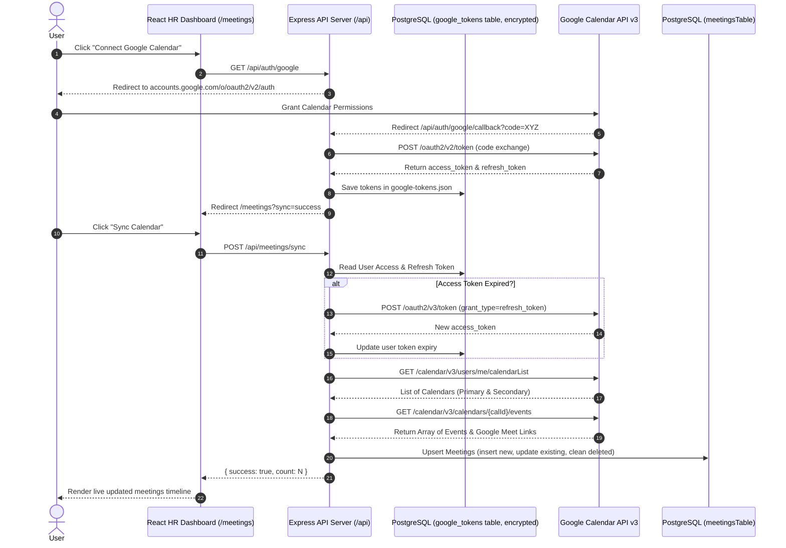

# 📅 Google Calendar & Google Meet Live Integration Guide

This guide explains how **HROS** connects to Google Calendar to fetch live meeting details, synchronize Google Meet video links, handle OAuth 2.0 authentication, and store synced meetings in the database.

---

## 🏗️ Architecture & Component Flow



---

## 🛠️ Step-by-Step Implementation Details

### 1. OAuth 2.0 Authentication Setup (`/api/auth/google`)
To request calendar access from Google, the server initiates an OAuth 2.0 authorization redirect with offline consent.

* **Endpoint**: `GET /api/auth/google`
* **Requested Scopes**:
  - `https://www.googleapis.com/auth/calendar`
  - `https://www.googleapis.com/auth/calendar.events`
* **Parameters**:
  - `access_type=offline` (Requests a `refresh_token` for persistent background syncing)
  - `prompt=consent` (Ensures refresh token is re-issued)

---

### 2. Authorization Callback & Token Storage (`/api/auth/google/callback`)
When the user grants consent, Google redirects back with a one-time authorization `code`.

* **Token Exchange**:
  ```typescript
  const tokenRes = await fetch("https://oauth2.googleapis.com/token", {
    method: "POST",
    headers: { "Content-Type": "application/x-www-form-urlencoded" },
    body: new URLSearchParams({
      code,
      client_id: process.env.GOOGLE_CLIENT_ID,
      client_secret: process.env.GOOGLE_CLIENT_SECRET,
      redirect_uri: `http://localhost:8080/api/auth/google/callback`,
      grant_type: "authorization_code",
    }),
  });
  ```
* **Storage Schema** (`google_tokens` table in PostgreSQL, not a flat file):
  ```typescript
  // lib/db/src/schema/google-tokens.ts
  export const googleTokens = pgTable("google_tokens", {
    id: uuid("id").primaryKey().defaultRandom(),
    userId: uuid("user_id").notNull().unique().references(() => users.id),
    accessToken: text("access_token").notNull(),   // encrypted at rest (e.g. via pgcrypto or app-level AES)
    refreshToken: text("refresh_token").notNull(), // encrypted at rest
    expiry: timestamp("expiry").notNull(),
    createdAt: timestamp("created_at").defaultNow(),
    updatedAt: timestamp("updated_at").defaultNow(),
  });
  ```
  Storing tokens in a flat JSON file on disk doesn't scale past one developer's local machine, isn't safe on a real server, and won't survive redeploys/containers — the database table above is the production-safe replacement.

---

### 3. Automatic Token Refresh Logic
Before executing any sync, the server automatically inspects the stored token expiry time.

```typescript
if (Date.now() > userToken.expiry) {
  const refreshRes = await fetch("https://oauth2.googleapis.com/token", {
    method: "POST",
    headers: { "Content-Type": "application/x-www-form-urlencoded" },
    body: new URLSearchParams({
      client_id: process.env.GOOGLE_CLIENT_ID!,
      client_secret: process.env.GOOGLE_CLIENT_SECRET!,
      refresh_token: userToken.refreshToken,
      grant_type: "refresh_token",
    }),
  });
  const refreshData = await refreshRes.json();
  userToken.accessToken = refreshData.access_token;
  userToken.expiry = Date.now() + (refreshData.expires_in * 1000);
  await saveTokens(tokens);
}
```

---

### 4. Fetching Live Events & Extracting Google Meet Links (`/api/meetings/sync`)

The sync endpoint executes live queries against Google Calendar APIs:

1. **Discover Writable Calendars**:
   Queries `https://www.googleapis.com/calendar/v3/users/me/calendarList` to discover both primary and secondary shared team calendars.

2. **Query Recent & Future Events**:
   Calls `https://www.googleapis.com/calendar/v3/calendars/{calendarId}/events?singleEvents=true&orderBy=startTime&timeMin={7_DAYS_AGO}`.

3. **Extract Google Meet Video Links**:
   Checks multiple fallback properties to retrieve video conference URLs:
   - `event.hangoutLink`
   - `event.conferenceData.entryPoints` (where `entryPointType === 'video'`)
   - `event.location` (if URL format)

4. **Upsert into Database (`meetingsTable`)**:
   - Uses `googleEventId` to prevent duplicates.
   - If the event exists in PostgreSQL, updates title, description, time slots, attendees, and meeting links.
   - If the event is new, inserts a record with `source: 'GOOGLE_CALENDAR'`.
   - **Cleanup**: Any meeting tagged `GOOGLE_CALENDAR` that was deleted in Google is automatically purged from the local database.

---

### 🧪 5. Simulated / Demo Mode

For local development or environments without active Google OAuth API Keys, the sync endpoint accepts `{ simulated: true }`:

```powershell
# API Payload for Demo Mode
Invoke-RestMethod -Uri "http://localhost:8080/api/meetings/sync" -Method POST -ContentType "application/json" -Body '{"simulated": true}'
```

This injects realistic Google Meet events (e.g. `https://meet.google.com/qwe-rtyu-iop`) into the dashboard so developers can test the complete calendar UI immediately.

---

## 📜 Key Source Files Reference
* **Backend Integration Route**: [`google-calendar.ts`](file:///c:/hros/artifacts/api-server/src/routes/google-calendar.ts)
* **Meetings Database Route**: [`meetings.ts`](file:///c:/hros/artifacts/api-server/src/routes/meetings.ts)
* **Frontend Calendar Page**: [`meetings.tsx`](file:///c:/hros/artifacts/hr-dashboard/src/pages/meetings.tsx)
